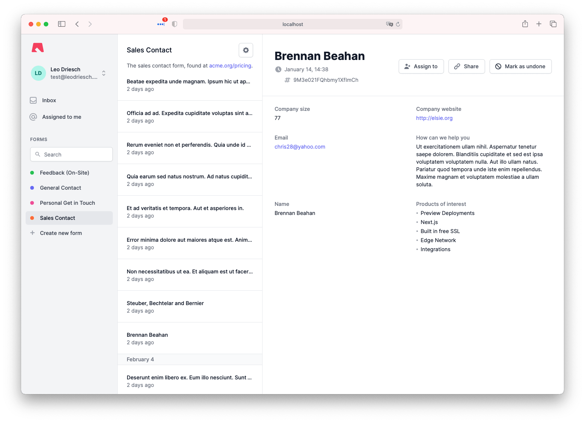
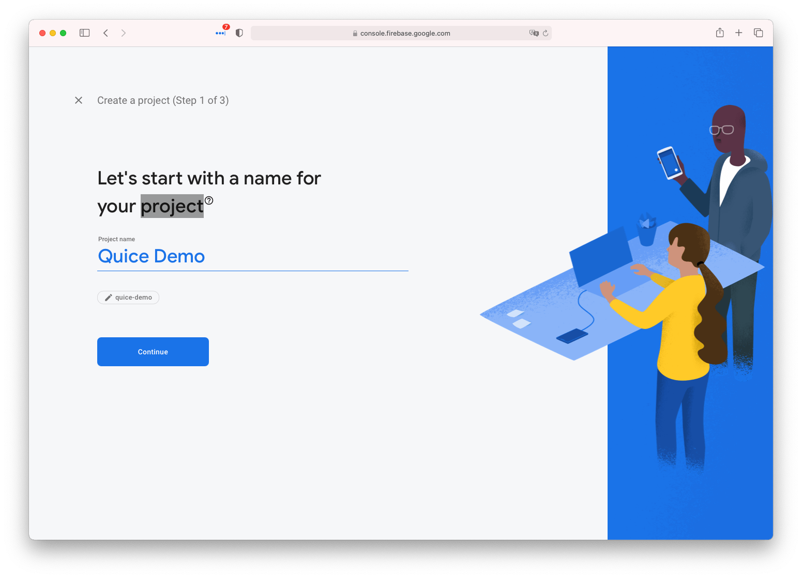
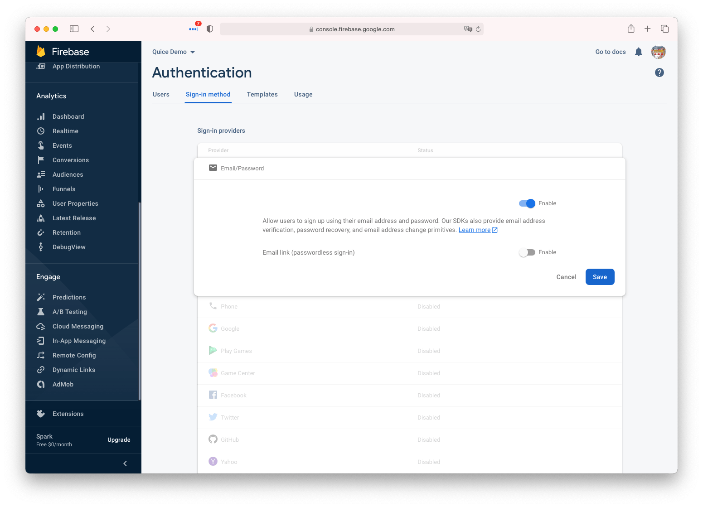
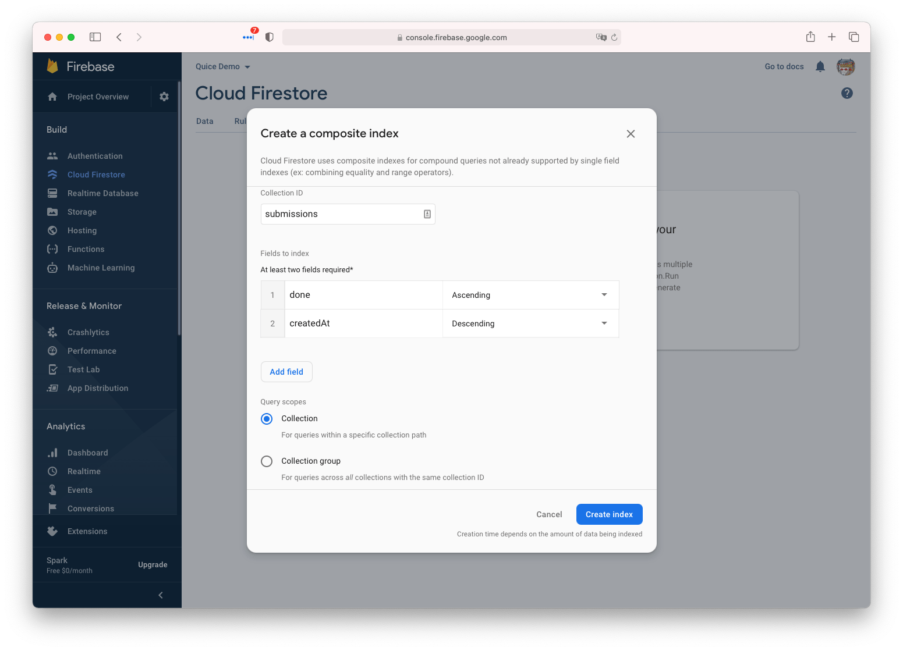
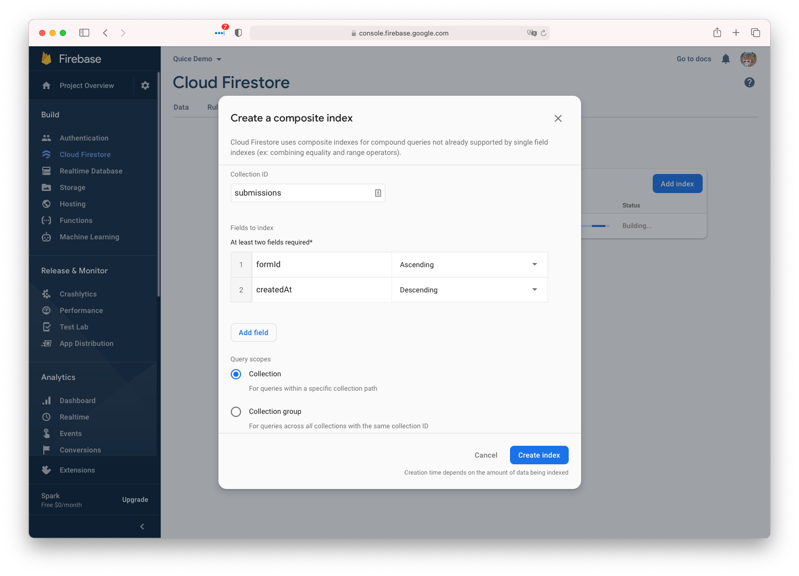
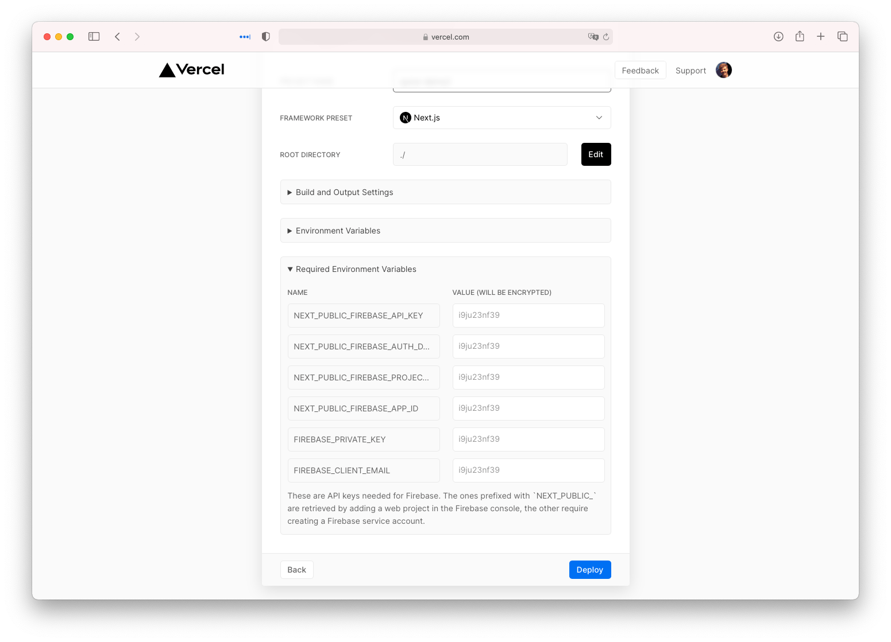
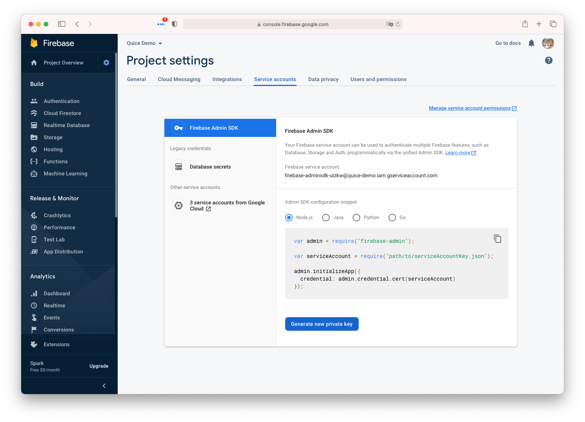
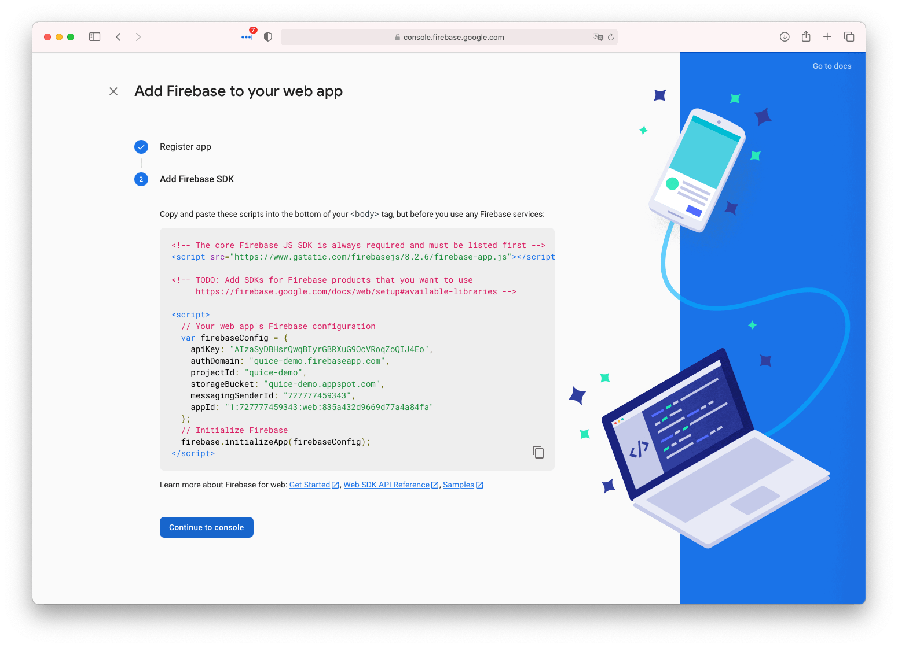

<h1 align="center">Quice</h1>

    <strong>The Self-Hosted Form Submission Service</strong>

    
    
    

    <a href="#-features"><b>Features</b></a>
      •  
    <a href="#-demo"><b>Demo</b></a>
      •  
    <a href="#-get-started"><b>Get Started</b></a>  
      •  
    <a href="#-contribute"><b>Contribute</b></a>

---

Quice is a headless service to handle any kind of form submissions. It is meant
to be self-hosted on Vercel and uses Firebase for backend services. It exposes a
REST endpoint to which you can send arbitrary JSON to, which will then be stored
in Cloud Firestore.

All submissions can be accessed through the web interface, where the submission
data will be displayed in an organized layout.

 

## ❯ Features

 

**Self Hosted**

You can deploy the application to your own Vercel account and connect it with
your own Firebase project. This way you control your data.

 

**Ready for Teams**

Get your whole team onboard with an easy-to-understand. Anybody can be assigned
to work on taking action to a form submission, so you always have a clear
understanding on what needs to be worked on.

 

**Customizable**

During deployment you will fork the project, which will allow you to add any
custom features you and your team need. If you implemented a feature you think
everyone would benefit from, please send in a pull request!

 

## ❯ Demo

If you want to have a look at the interface before deploying it yourself take a
look at the public demo.

    

You can use the account `test@quice.io` with the password `password` if you
refuse to create your own account.

> Please note that the demo app is modified to be accessible publicly. After you
> deploy your own version, only you and members of your team will be able to
> access it.

 

## ❯ Get Started

In this paragraph you will deploy your own instance of Quice with the Firebase
console and the Vercel deploy button.

### 1. Create a new firebase project

Head to [console.firebase.google.com](https://console.firebase.google.com/) and
log in. Then hit the create a new project button and give it a name:

Disable Google Analytics for the project and then create it. You will now be
redirected into the Firebase Console. Now we have to enable the different
features Quice is going to use, first off Firebase Authentication.

Head over to the authentication tab in the menu and click the Get Started
button. Enable the "Email/Password" provider and hit save.

That's it for authentication, now we want to enable Firestore. Go over to the
"Cloud Firestore" tab in the menu, which is right below Authentication.

Click on "Create Database", choose the Production mode for security rules and
choose any region that is closest to you.

> Your Vercel deployment will be in US east, which cannot be changed for free
> accounts, so you cannot go wrong with picking `us-central` as the location,
> since it is the closest to your Vercel deployment. Read more about Vercel
> regions [here](https://vercel.com/docs/edge-network/regions).

We will now set up the Firestore security rules, which you can find under the
"Rules" tab along the top tab bar. Here you want to paste the content of the
most recent security rules file for Quice, which can be found
[here](https://github.com/leodr/quice/blob/main/firebase/firestore.rules).

After that we have to create two composite indexes. Head over to the "Indexes"
settings in the top tab bar and create an index.

The first index will go on the `submissions` collection and index the fields
`done` ascending and `createdAt` descending. Set "Collection" as the query
scope:

The second index will also go on the `submissions` collection, but it will index
the fields `formId` ascending and `createdAt` descending. Set "Collection" as
the query scope:

This is it for setting up Firebase, but don't close the Firebase console quite
yet!

### 2. Collect Environment Variables

We will now collect the Firebase credentials which will be supplied to the
deployment as environment variables. Click the deploy button below and create
the project until you get to the project settings where you will be asked to
enter environment variables.

    <a href="https://vercel.com/new/git/external?repository-url=https%3A%2F%2Fgithub.com%2Fleodr%2Fquice%2Ftree%2Fmain&env=NEXT_PUBLIC_FIREBASE_API_KEY,NEXT_PUBLIC_FIREBASE_AUTH_DOMAIN,NEXT_PUBLIC_FIREBASE_PROJECT_ID,NEXT_PUBLIC_FIREBASE_APP_ID,FIREBASE_PRIVATE_KEY,FIREBASE_CLIENT_EMAIL&envDescription=These%20are%20API%20keys%20needed%20for%20Firebase.%20The%20ones%20prefixed%20with%20%60NEXT_PUBLIC_%60%20are%20retrieved%20by%20adding%20a%20web%20project%20in%20the%20Firebase%20console%2C%20the%20other%20require%20creating%20a%20Firebase%20service%20account.&project-name=quice&repo-name=quice&demo-title=Quice%20Demo&demo-description=A%20publicly%20available%20demo%20of%20the%20the%20headless%20form%20submission%20service.&demo-url=https%3A%2F%2Fquice.io%2F&demo-image=https%3A%2F%2Fibb.co%2F59P1sQR"></a>

Your page should look something like this:

First we will grab the credentials for a Firebase service account. In the
Firebase console, hit the little cog icon at the top of the sidebar menu, go to
"Project settings" and in the top tab bar choose "Service accounts".

Here generate a new private key. You will download a JSON file, from which you
want to grab the `private_key` and `client_email` entries and paste them into
the `FIREBASE_PRIVATE_KEY` and `FIREBASE_CLIENT_EMAIL` fields on the Vercel
deployment form.

> It is important that these are not prefixed with `NEXT_PUBLIC_` because we do
> not want to expose them to the browser environent.

Next we will grab the credentials for the web interface. For this go the
"Project overwiew" and hit the white "Web app" button on next to the iOS and
Android buttons.

Give the app an arbitrary name (e.g. "Web interface") and disable Firebase
hosting. You will then be presented with a short code snippet. Here we are
interested in the `firebaseConfig` object.

Grab these keys from the config object and paste them into the Vercel deployment
console:

| `firebaseConfig` key | Vercel environment variable        |
| -------------------- | ---------------------------------- |
| `apiKey`             | `NEXT_PUBLIC_FIREBASE_API_KEY`     |
| `authDomain`         | `NEXT_PUBLIC_FIREBASE_AUTH_DOMAIN` |
| `projectId`          | `NEXT_PUBLIC_FIREBASE_PROJECT_ID`  |
| `appId`              | `NEXT_PUBLIC_FIREBASE_APP_ID`      |

After that you can finish up the Vercel deployment and visit your fully set up
site!

 

## ❯ Contribute

If you think you have any ideas that could benefit the project, feel free to
create a pull request!

---

    
        Project by Leo Driesch, released under <a href="https://github.com/leodr/quice/blob/main/LICENSE">MIT license</a>.
    

    
    &nbsp;&nbsp;
    

